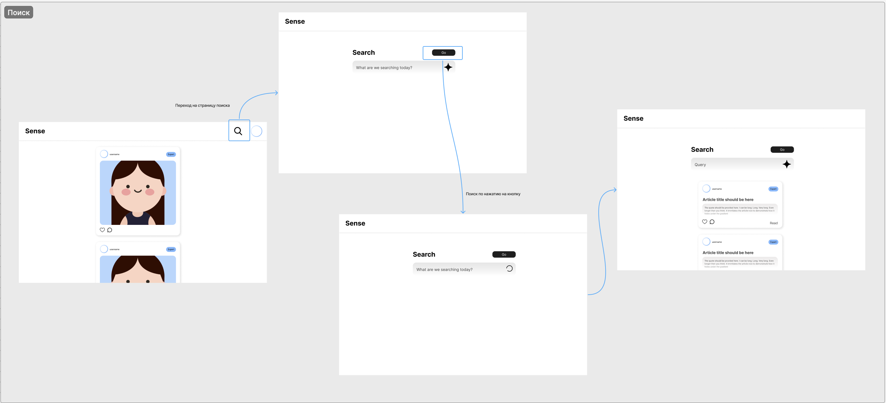
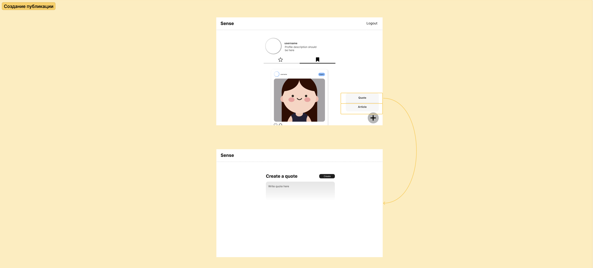

# Архитектура web-приложения

## Концептуальное проектирование web-приложения

**Основная аудитория:** группы пользователей 16–30 лет и 30+ лет.

**Цель проекта:** создать платформу, где пользователи могут публиковать, читать и делиться цитатами и статьями, формируя сообщество вокруг интересов и знаний.

**Тип интерфейса:** `монопольный` — каждый пользователь получает личный профиль и персонализированную ленту публикаций.

**Принципы интерфейса:**

* Минимализм и лаконичность дизайна;
* Поддержка accessibility (доступность для людей с ограниченными возможностями);
* Концентрация внимания на контенте, без лишних элементов;
* Интуитивная навигация и простота взаимодействия.

## Организация инфраструктуры взаимодействия

### Главная страница

* Красивое оформление;
* Навигация;
* Лого.

### Лента публикаций

* Последовательность последних постов от разных пользователей;
* Каждая публикация содержит:

  * бэйдж статуса пользователя;
  * описание поста или публикации;
  * комментарии;
  * кнопки «сохранить» и «нравится»;
* Возможна фильтрация по:

  * статусу пользователя;
  * типу публикации (статья, цитата, пост).

### Поиск

* Поддержка ИИ для быстрого нахождения публикаций;
* Фильтры по типу публикации, статусу пользователя;
* Удобная сортировка по релевантности и дате.

### Страница чтения публикации

* Максимально простая, чтобы не отвлекать пользователя;
* Возможность комментирования, лайка и сохранения;
* Рекомендации схожих публикаций.
* Кнопка создать.

### Личная страница пользователя

* Просмотр собственных публикаций;
* Доступ к сохранённым публикациям;
* Настройки профиля и предпочтений;
* История взаимодействия с контентом.

## Навигация по web-приложению

#### Главная страница

> Авторизованная зона:
- страница поиска
- личная страница
- футер

> Неавторизованная зона:
- переход к форме входа / регистрации
- футер

#### Страница поиска
- страница поиска (обновление)
- личная страница

#### Личная страница
- страница поиска
- настройки
- кнопка выхода из аккаунта

#### Страница просмотра публикации
- страница поиска
- личная страница

## Карта сайта

## Навигационная модель персонажей

## Диаграмма путей

## Интерактивные раскадровки персонажей

## Совокупная диаграмма взаимодействия

## CJM

## Словарь терминов

Post -  публикация с фотографией и описанием.

Quote - публикация в виде цитаты, небольшая.

Article - статья для чтения.
