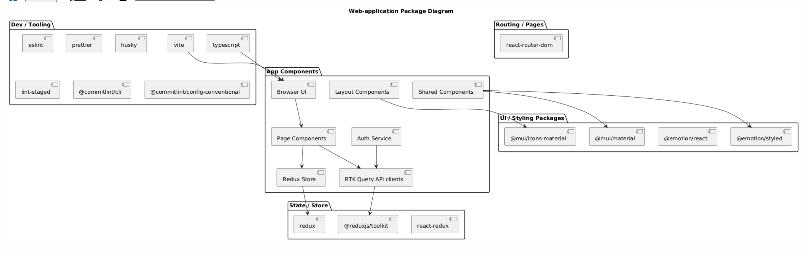
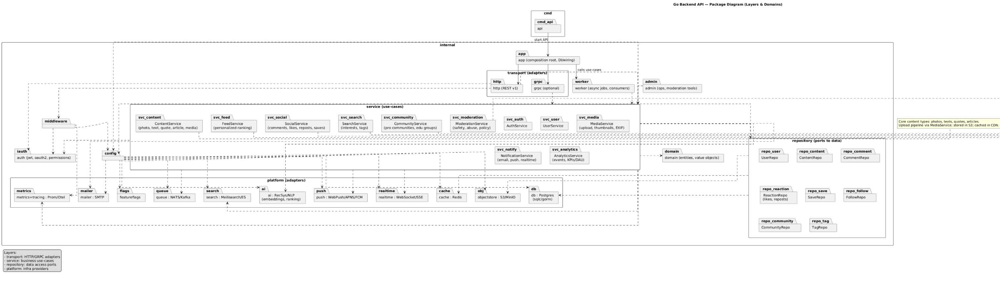

## Постановка задачи

- Сравнить ключевых и косвенных конкурентов по параметрам: трафик, регионы, монетизация, каналы привлечения, портрет пользователя, коллаборации.
- Выделить уникальные сценарии использования соцсети для разных целевых групп.
- Сформировать основу для позиционирования продукта, учитывая культурные, возрастные и профессиональные особенности аудитории.

## Стратегия дизайна

### Заинтересованные стороны
`Пользователи`: разные группы лиц разных возрастов, которые заинтересованы в быстром приложении с удобном интерфейсом и в поиске нужного конетента

`Команда разработки`: фронт и бэкенд разработчики, специлист по ИИ

`Заказчик`: рассматриваем проект как стартап команды разработки

### Видение продукта заинтересованными лицами (задачи продукта)
Приложение должно решать следующие задачи:

- Поддержка публикации фото, текстов и статей.

- Возможность общения между пользователями (комментарии, лайки, репосты).

- Создание персонализированной ленты новостей и контента.

- Поиск по интересам (фотография, искусство, философия, управление проектами).

- Поддержка профессиональных сообществ и образовательных групп.

### Конфликты и противоречия
Баланс между развлекательным и профессиональным контентом.

Разные ожидания от интерфейса: молодой аудитории нужен яркий и быстрый, старшей — спокойный и структурированный.

### Задачи бизнеса, маркетинга и брендинга
**Задачи бизнеса (верифицируемые):**

- Увеличить количество активных пользователей до 50 000 в течение первого года.

- Достичь среднего времени удержания пользователя > 10 минут в день.

- Получить первых 10 B2B-партнёров (образовательные организации, фотостудии).

**Задачи маркетинга:**

- Создать имидж приложения как «социальной сети для творчества и знаний».

- Активно продвигать среди студентов, молодых специалистов и экспертов.

**Задачи брендинга:**

- Использовать визуальный стиль, объединяющий эстетику и профессионализм.

- Подчеркнуть ценность сообщества и обмена знаниями.

### Измеримые критерии успешности

- Количество зарегистрированных пользователей.

- Количество ежедневных активных пользователей (DAU).

- Среднее время, проведённое в приложении.

- Количество публикаций в день.

- Уровень вовлечённости (лайки, комментарии, репосты).

- Количество опубликованных экспертных материалов.

### Технические возможности и ограничения

- PWA приложение.

- Веб-приложение с адаптивной версткой и быстрым удобным интерфейсом

- Поддержка публикации фото, текстов, статей, цитат.

- Личная лента.

- Система комментариев и рекомендаций.

### Представления заинтересованных лиц о пользователях (целевая аудитория)

- Молодые специалисты (18–30 лет) — креативные пользователи, активно делящиеся фото и постами.

- Профессионалы среднего возраста (30–45 лет) — используют приложение для обмена опытом, чтения экспертных материалов.

- Эксперты и старшее поколение (45+) — публикуют статьи и участвуют в дискуссиях.

## Диаграммы бизнес-процессов

## Use-case диаграммы

## Диаграммы деятельности

## Диаграммы классов и объектов

## Диаграммы последовательности

## Диаграммы компонентов

## Диаграммы пакетов

## Диаграммы развертывания

## Диаграмма БД

## Event Storming

## Event Modeling

## C4 - Архитектура

