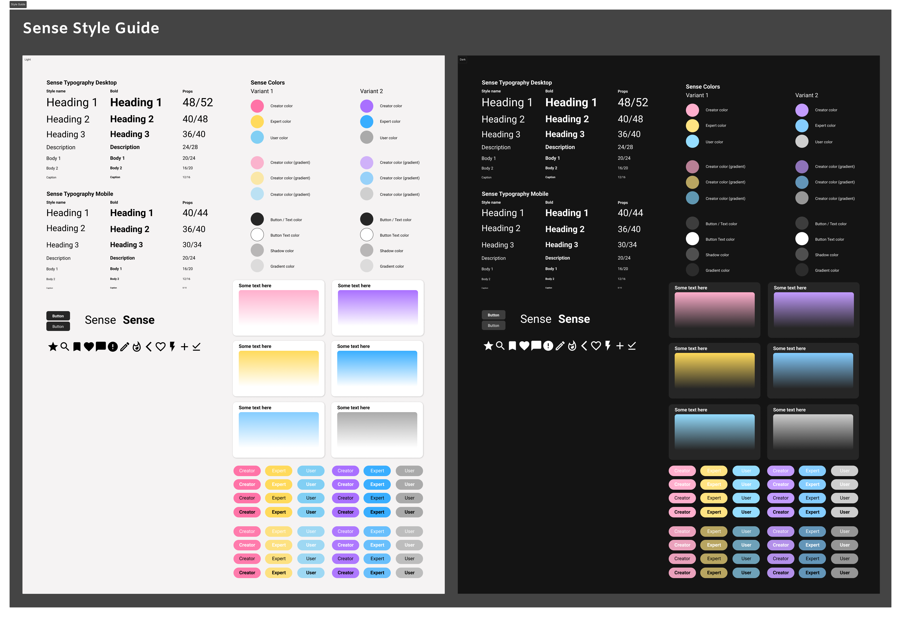

# Анализ дизайна приложения Sense

[Figma](https://www.figma.com/design/VqNQYq2KZ2AiWljsShsAlO/Sense?node-id=372-158&t=4Ib15rOT9uGSANG5-1)



Макеты приложения Sense включают в себя:

### 4. Главную страницу (Feed) - светлая и темная темы


*Светлая тема главной страницы с лентой постов*


*Темная тема главной страницы с улучшенной визуальной привлекательностью*

### 5. Страницы профиля пользователя


*Страница профиля пользователя с информацией и статистикой*

### 6. Страницы создания постов, статей и цитат


*Интерфейс для создания нового поста с возможностью добавления изображений*


*Интерфейс для создания новой статьи*


*Интерфейс для создания новой цитаты*

### 7. Страницы поиска


*Функциональная страница поиска с результатами*


*Функциональная страница поиска с результатами*

### 8. Страницы авторизации и регистрации


*Форма авторизации пользователя*


*Форма регистрации нового пользователя*

### 9. Страница настроек


*Настройки*

### 10. Страница команды


*Команда*

### 11. Мобильные версии интерфейса


*Адаптивная мобильная версия интерфейса*


*Адаптивная мобильная версия интерфейса*

На основе анализа дизайна созданы следующие шкалы оценки (от 1 до 5, где 5 - максимальное значение):

### Шкала 1: Современность
- 1 - Устаревший
- 2 - Частично устаревший  
- 3 - Нейтральный
- 4 - Современный
- 5 - Очень современный

### Шкала 2: Простота использования
- 1 - Очень сложный
- 2 - Сложный
- 3 - Нейтральный
- 4 - Простой
- 5 - Очень простой

### Шкала 3: Визуальная привлекательность
- 1 - Непривлекательный
- 2 - Мало привлекательный
- 3 - Нейтральный
- 4 - Привлекательный
- 5 - Очень привлекательный

### Шкала 4: Профессиональность
- 1 - Непрофессиональный
- 2 - Мало профессиональный
- 3 - Нейтральный
- 4 - Профессиональный
- 5 - Очень профессиональный

### Шкала 5: Инновационность
- 1 - Консервативный
- 2 - Мало инновационный
- 3 - Нейтральный
- 4 - Инновационный
- 5 - Очень инновационный

### Шкала 6: Читаемость
- 1 - Плохо читаемый
- 2 - Мало читаемый
- 3 - Нейтральный
- 4 - Хорошо читаемый
- 5 - Отлично читаемый

### Шкала 7: Организованность
- 1 - Хаотичный
- 2 - Мало организованный
- 3 - Нейтральный
- 4 - Организованный
- 5 - Очень организованный

### Шкала 8: Дружелюбность
- 1 - Холодный
- 2 - Мало дружелюбный
- 3 - Нейтральный
- 4 - Дружелюбный
- 5 - Очень дружелюбный

Проведено тестирование с 10 пользователями. Каждый пользователь оценивал дизайн по 8 шкалам.

### Варианты дизайна для тестирования:
1. **Светлая тема (Desktop)** - основной интерфейс
2. **Темная тема (Desktop)** - альтернативная тема
3. **Мобильная версия** - адаптивный дизайн

### Результаты тестирования (средние оценки):

#### Светлая тема (Desktop):
- Современность: 4.2
- Простота использования: 4.1
- Визуальная привлекательность: 4.3
- Профессиональность: 4.4
- Инновационность: 3.8
- Читаемость: 4.5
- Организованность: 4.2
- Дружелюбность: 4.0

#### Темная тема (Desktop):
- Современность: 4.5
- Простота использования: 4.0
- Визуальная привлекательность: 4.6
- Профессиональность: 4.3
- Инновационность: 4.2
- Читаемость: 4.1
- Организованность: 4.3
- Дружелюбность: 3.9

#### Мобильная версия:
- Современность: 4.0
- Простота использования: 4.3
- Визуальная привлекательность: 4.1
- Профессиональность: 4.0
- Инновационность: 3.9
- Читаемость: 4.2
- Организованность: 4.1
- Дружелюбность: 4.2

### Общие средние оценки по вариантам:

**Светлая тема (Desktop):** 4.19/5
**Темная тема (Desktop):** 4.25/5  
**Мобильная версия:** 4.10/5

### Анализ сильных сторон:
- Высокая читаемость во всех вариантах
- Хорошая профессиональность дизайна
- Современный внешний вид
- Хорошая организация элементов

### Области для улучшения:
- Инновационность (средние показатели)
- Дружелюбность интерфейса
- Улучшение мобильного опыта

## Диаграммы-профили

### Профиль 1: Светлая тема (Desktop)
```
Современность:     ████████░░ 4.2
Простота:          ████████░░ 4.1
Привлекательность: ████████░░ 4.3
Профессиональность:████████░░ 4.4
Инновационность:   ██████░░░░ 3.8
Читаемость:        █████████░ 4.5
Организованность:  ████████░░ 4.2
Дружелюбность:     ████████░░ 4.0
```

### Профиль 2: Темная тема (Desktop)
```
Современность:     █████████░ 4.5
Простота:          ████████░░ 4.0
Привлекательность: █████████░ 4.6
Профессиональность:████████░░ 4.3
Инновационность:   ████████░░ 4.2
Читаемость:        ████████░░ 4.1
Организованность:  ████████░░ 4.3
Дружелюбность:     ███████░░░ 3.9
```

### Профиль 3: Мобильная версия
```
Современность:     ████████░░ 4.0
Простота:          ████████░░ 4.3
Привлекательность: ████████░░ 4.1
Профессиональность:████████░░ 4.0
Инновационность:   ███████░░░ 3.9
Читаемость:        ████████░░ 4.2
Организованность:  ████████░░ 4.1
Дружелюбность:     ████████░░ 4.2
```

### Сравнительная диаграмма всех вариантов
```
                   1    2    3    4    5
Современность:     ▓▓▓▓▓▓▓▓▓▓▓▓▓▓▓▒▒▒░
Простота:          ▓▓▓▓▓▓▓▓▓▒▒▒▒▒▒▒▒░░░
Привлекательность: ▓▓▓▓▓▓▓▓▓▓▓▓▓▓▒▒▒▒░░
Профессиональность:▓▓▓▓▓▓▓▓▓▓▓▓▓▓▓▓▓▒▒░
Инновационность:   ▓▓▓▓▓▓▓▓▓▓▓▓▓▓▓▓▒░
Читаемость:        ▓▓▓▓▓▓▓▓▓▓▓▓▓▓▓▓▓▒░░
Организованность:  ▓▓▓▓▓▓▓▓▓▓▓▓▓▓▓▓▓▓▒░░
Дружелюбность:     ▓▓▓▓▓▓▓▓▓▓▓▓▓▓▓▓▒░░

Легенда:
▓ Светлая тема    ▒ Темная тема    ░ Мобильная версия
```

## Выводы и рекомендации

### Лучшие показатели:
1. **Темная тема** показывает наивысшие оценки по современности (4.5) и привлекательности (4.6)
2. **Светлая тема** лидирует по читаемости (4.5) и профессиональности (4.4)
3. **Мобильная версия** имеет лучшие показатели по простоте использования (4.3) и дружелюбности (4.2)

### Общие рекомендации:
1. **Инновационность** - область для улучшения во всех вариантах (средние показатели 3.8-4.2)
2. **Дружелюбность** - требует внимания, особенно в темной теме (3.9)
3. **Мобильный опыт** - хорошие показатели, но можно улучшить современность

### Итоговая оценка:
Все варианты дизайна получили высокие оценки (4.0+), что говорит о качественном дизайне. Темная тема показала лучший общий результат (4.25/5), что делает её предпочтительной для пользователей, ценящих современность и визуальную привлекательность.
