## Анализ конкурентов

| Конкурент | Тип конкурента | Цена / монетизация | Объём трафика / динамика | Топ-регионы | Каналы привлечения (топ-3) | Портрет пользователя | Коллаборации со знаменитостями |
|-----------|----------------|-------------------|-------------------------|-------------|---------------------------|---------------------|------------------------------|
| VK (vk.com) | Ключевой, прямой; локальный (RU/CIS) | Бесплатно; экосистема VK Combo ~149 ₽/мес (пакет привилегий) | 968.4 млн визитов (авг 2025); динамика нет данных | Россия 89.25%, Казахстан 2.65%, Беларусь 2.44% | Direct ~70%, Organic Search ~19%, Referrals ~7% | Мужчины 59%; ядро 25–34 | Российские артисты, блогеры, спортсмены; VK Fest, VK Music |
| Facebook (facebook.com) | Ключевой, прямой; глобальный | Бесплатно | 12 млрд визитов (авг 2025); –1.12% месяц к месяцу | США 23%, Вьетнам 5.9%, Филиппины 5.3% | Direct ~77%, Organic ~19% | Мужчины 55%; 25–34 | Глобальные знаменитости, политики, бизнес-лидеры; Facebook Live, Meta Verified |
| Instagram (instagram.com) | Ключевой, прямой; глобальный | Бесплатно | 6.7 млрд (авг 2025); +0.49% месяц к месяцу | США 19%, Бразилия 9.5%, Индия 5.5% | Direct ~68%, Organic ~26% | Мужчины 56%; 25–34 | Инфлюенсеры, модели, актёры; Instagram Reels, Stories, Shopping |
| TikTok (tiktok.com) | Ключевой, прямой; глобальный | Бесплатно | ~2.9 млрд визитов (июль/авг 2025) | США/Индия/Бразилия (типично) | m.tiktok.com: Direct ~72%, Organic ~12% | Аудитория моложе среднего (сильный Gen Z-пул) | TikTok-звёзды, музыканты, комедианты; Creator Fund, Brand Takeovers |
| X / Twitter (x.com) | Прямой; глобальный | Бесплатно; X Premium $3–$40/мес (Premium $8) | 4.4 млрд (авг 2025); –1.09% месяц к месяцу | США 26%, Япония 13.8%, Великобритания 4.6% | Direct ~73%, Organic ~22% | Мужчины 67.5%; 25–34 | Политики, журналисты, актёры; Twitter Spaces, Super Follows |
| Reddit (reddit.com) | Косвенный (контент-комьюнити), частично прямой; глобальный | Бесплатно (есть Premium) | 4.1 млрд (авг 2025); +1.66% месяц к месяцу | США 48%, Великобритания 7%, Канада 6.6% | Organic ~69%, Direct ~29% | Мужчины 63%; 25–34 | AMA-сессии с учёными, актёрами, политиками; Reddit Talk |
| Telegram (t.me / telegram.org) | Прямой (соц-фид через каналы), глобальный с сильным RU/CIS | Бесплатно; Telegram Premium ~$4.99/мес (США) | t.me: 804.1 млн (июль 2025); –0.89% месяц к месяцу | Россия 44%, Украина 5.9%, США 4.2% | Direct ~46%, Referrals ~27%, Organic ~20% | Мужчины 63%; 25–34 | Каналы знаменитостей, блогеров; Telegram Stars, Premium |
| Одноклассники (ok.ru) | Прямой; локальный (RU/CIS) | Бесплатно | 396.8 млн (июль 2025); +1.57% месяц к месяцу | Россия 81%, Беларусь 2.8%, Германия 2.2% | Direct ~62%, Organic ~28% | Мужчины 56%; ядро 55–64 | Российские артисты, телеведущие; OK Live, OK Stories |
| LinkedIn (linkedin.com) | Косвенный (проф. сеть), прямой в B2B; глобальный | Бесплатно; Premium ~$29.99+/мес | 1.8 млрд (авг 2025); –4.24% месяц к месяцу | США 33%, Индия 8.3%, Великобритания 6% | Direct ~67%, Organic ~29% | Мужчины 54%; 25–34 (white-collar) | Бизнес-лидеры, эксперты, CEO; LinkedIn Learning, Creator Mode |
| WhatsApp (whatsapp.com) | Косвенный (мессенджер-соц), глобальный | Бесплатно | 3.9 млрд (июль 2025); +2.47% месяц к месяцу | Бразилия 19%, Индия 11.8%, Индонезия 7% | Direct ~75%, Organic ~19% | Мужчины 54%; 25–34 | Бизнес-аккаунты знаменитостей; WhatsApp Business, Status |
| Snapchat (snapchat.com) | Косвенный; глобальный (сильн. США/Европа) | Бесплатно; Snapchat+ ~$3.99/мес; также Lens+ $8.99/мес | ~147.6 млн визитов (июль 2025) | США/ЕС (веб-топ страны варьируют) | Accounts: Direct ~57%, Organic ~34% | Подростки/молодёжь; фокус на UGC-сториз | Snapchat-звёзды, музыканты; Snap Originals, Spotlight |
| WeChat | Ключевой в Китае; прямой; локально-глобальный (CN-центр.) | Бесплатно | ~1.38–1.40 млрд MAU (2025) | Китай — основной рынок (более половины базы) | Приложение-экосистема; веб-трафик нерелевантен | Универсальная аудитория, широкая демография | Китайские знаменитости, бренды; WeChat Official Accounts, Mini Programs |
| Мессенджер МАХ | Прямой; локальный (Россия); новый игрок | Бесплатно | 10 млн+ установок (RuStore/Google Play); предустановка в РФ с 01.09.2025 | Россия | Каналы: предустановка (OEM), органика из сторов/регистров (RuStore), PR/гос-СМИ | Массовая аудитория РФ; упор на «безопасный» нативный мессенджер | [Денис Дорохов](https://youtube.com/shorts/4FJfL7dtZPE?si=BhESRFkv0FsW01mh) и [Макс Верстаппен](https://www.instagram.com/reel/DODLpYoDa6N/?igsh=a2czZzA0MndndGo4)|
> Author: S.Senkevich

## Опросник и результаты опроса

# Анализ опроса: Социальные коммуникации в сети Интернет

## Демография участников

- **Пол**: большинство — женщины (54,5%), мужчины — 40,9%, предпочли не указывать — 4,6%.
  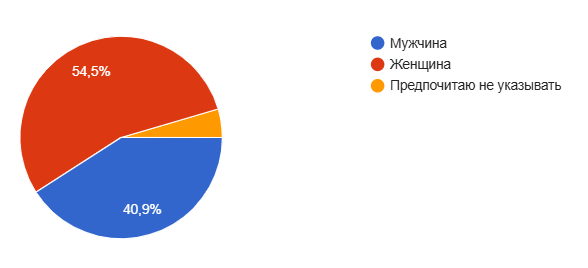

- **Возраст**: преобладающая группа — 19–21 лет (68,2%), далее — 14–18 лет (20,5%). Остальные возрастные группы представлены минимально.
  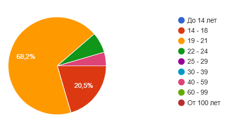

- **Занятость**: большинство — обучающиеся (36,4%) и совмещающие учёбу с работой (56,8%). Только 3 человека работают без учёбы.
  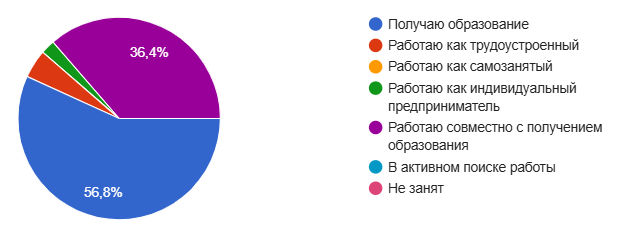

## Использование соцсетей

- **Пользуются соцсетями** — 97,7% участников.
  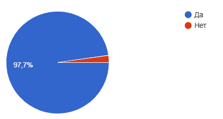

- **Популярные платформы**:
  - Telegram — 100%
  - YouTube — 76,7%
  - Instagram — 74,4%
  - TikTok — 58,1%
  - VK — 30,2%
  - Facebook и OK — 0%
  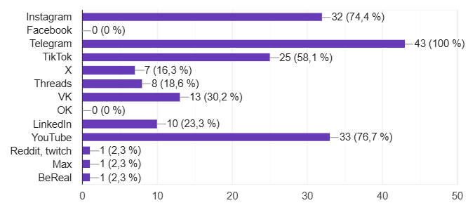

- **Время в соцсетях**: большинство проводят от 1 до 4 часов в день.
  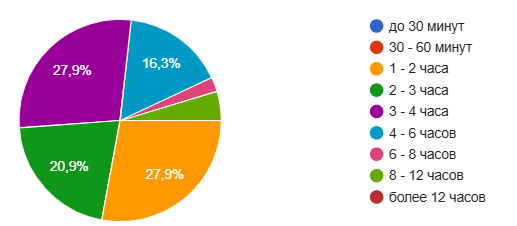

- **Частота заходов**: все участники заходят в соцсети несколько раз в день.
  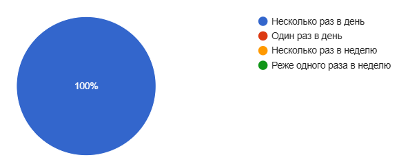

## Цели использования

- Основные цели:
  - Общение — 95,3%
  - Развлечения — 81,4%
  - Новости — 60,5%
  - Проф. развитие — 53,5%
  - Продвижение бренда — лишь 2,3%
  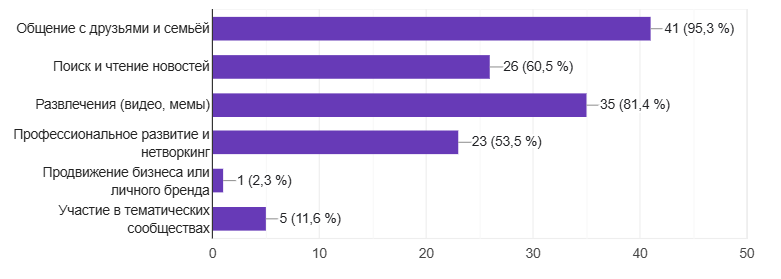

## Предпочтения по контенту

- Наиболее интересны:
  - Короткие видео — 76,7%
  - Фотографии — 72,1%
  - Мемы — 67,4%
  - Текстовые посты — 55,8%
  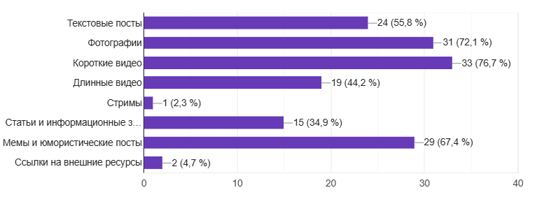

## Проблемы и безопасность

- **Удовлетворенность защитой данных**:
  - Только 14% полностью удовлетворены.
  - 51,2% затрудняются ответить.
  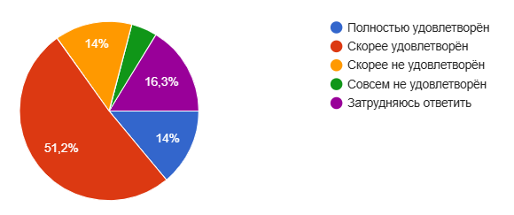

- **Основные проблемы**:
  - Навязчивая реклама — 83,7%
  - Фейковые новости — 65,1%
  - Утечка данных — 41,9%
  - Токсичные комментарии — 37,2%
  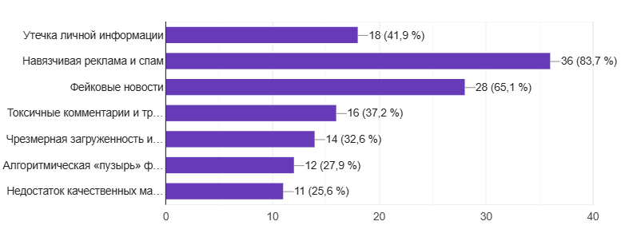

## Поведение и перегрузка

- **Создание контента**:
  - Временами активно — 39,5%
  - Практически никогда — 23,3%
  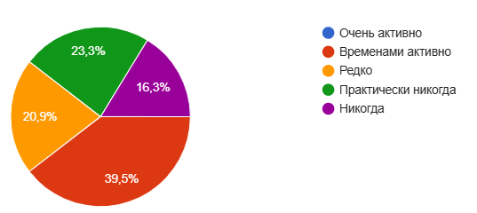

- **Информационная перегрузка**:
  - Регулярно — 11,6%
  - Иногда — 25,6%
  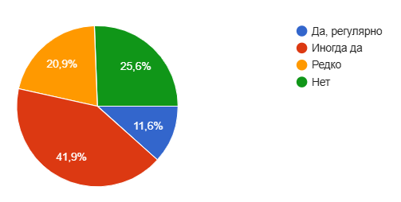

## Что может сократить время в соцсетях

- **Главные факторы**:
  - Альтернативные офлайн-активности — 53,5%
  - Осознание чрезмерного времени — 41,9%
  - Таймеры и лимиты — 20,9%
  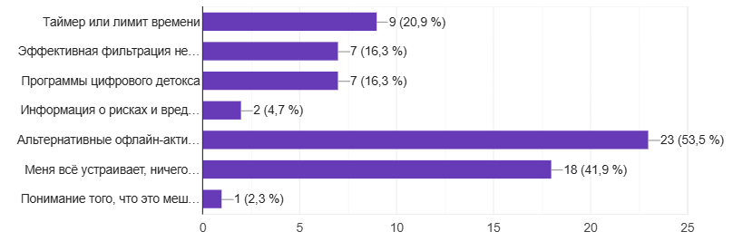

---

Общий вывод: соцсети — неотъемлемая часть жизни молодых пользователей, особенно для общения и развлечений. Однако существует обеспокоенность безопасностью, качеством контента и перегрузкой. Возможности для улучшения — фильтрация, тайм-менеджмент и развитие офлайн-альтернатив.

> Author: Cyril Filippov 
